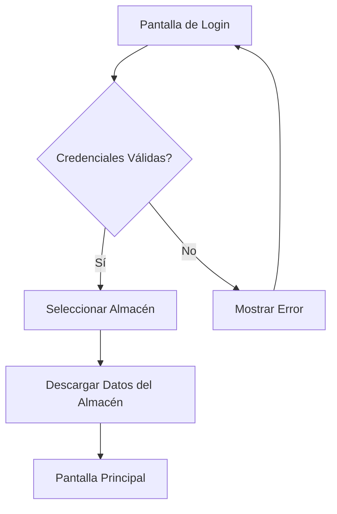
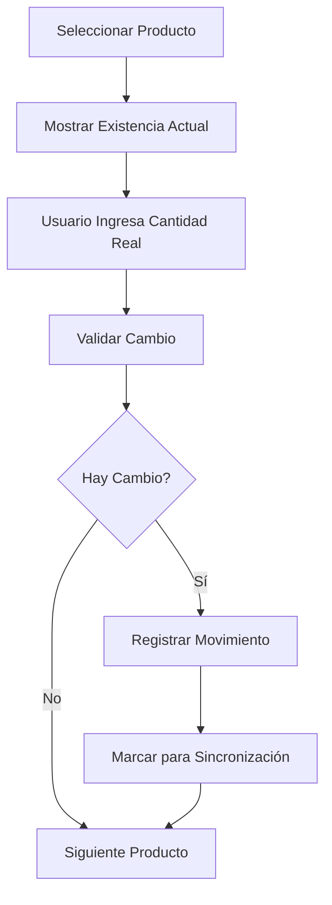
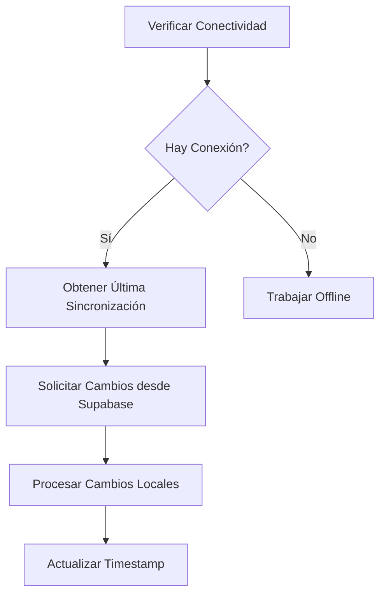
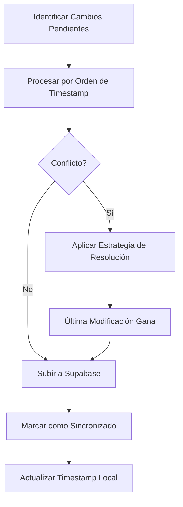
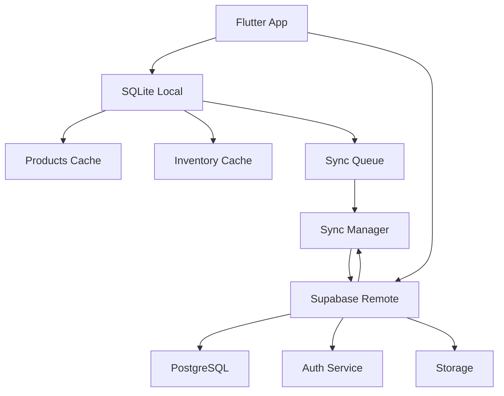
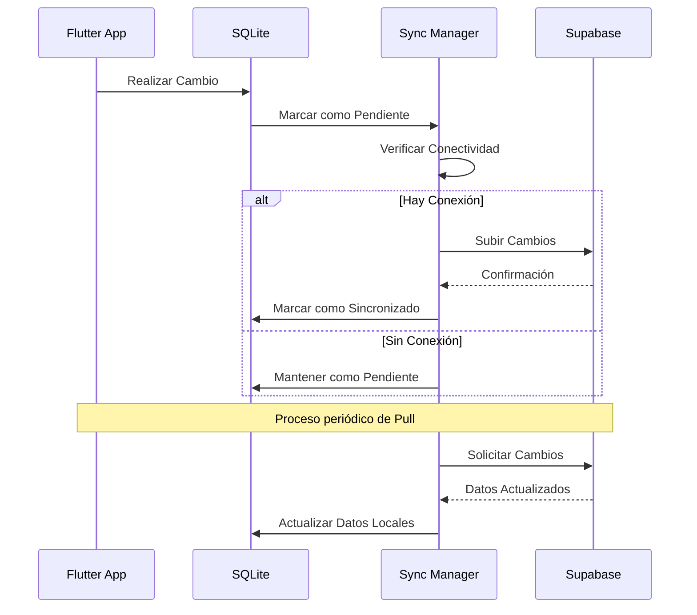
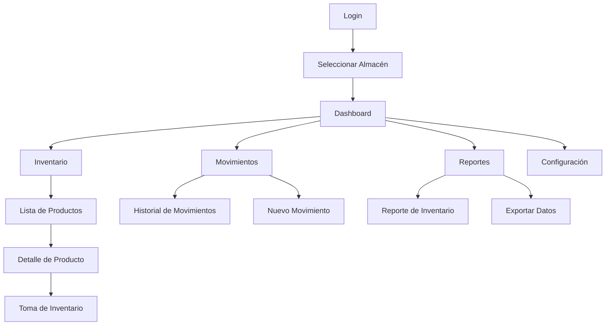

# Especificación Técnica - Aplicación Móvil de Gestión de Inventarios

## Tabla de Contenidos
1. [Resumen Ejecutivo](#resumen-ejecutivo)
2. [Arquitectura del Sistema](#arquitectura-del-sistema)
3. [Especificaciones Técnicas](#especificaciones-técnicas)
4. [Diseño de Base de Datos](#diseño-de-base-de-datos)
5. [Módulos Funcionales](#módulos-funcionales)
6. [Interfaz de Usuario](#interfaz-de-usuario)
7. [Estrategia de Sincronización](#estrategia-de-sincronización)
8. [Seguridad](#seguridad)
9. [Requisitos No Funcionales](#requisitos-no-funcionales)
10. [Plan de Implementación](#plan-de-implementación)
11. [Diagramas](#diagramas)

---

## Resumen Ejecutivo

Este documento describe la especificación técnica para una aplicación móvil de gestión de inventarios robusta desarrollada con Flutter y Dart, utilizando Supabase como backend principal y SQLite para almacenamiento local offline. La aplicación permitirá a los usuarios gestionar inventarios de manera eficiente tanto en línea como sin conexión, con sincronización automática cuando se restablezca la conectividad.

### Características Principales
- Gestión completa de inventarios con soporte offline
- Sincronización bidireccional entre SQLite local y Supabase
- Sistema de autenticación robusto con roles de usuario
- Interfaz intuitiva con Material Design 3
- Proceso de toma de inventario manual (sin escaneo individual)
- Sistema de filtros jerárquico y búsqueda avanzada

---

## Arquitectura del Sistema

### Arquitectura General
```
┌─────────────────┐    ┌─────────────────┐    ┌─────────────────┐
│   Flutter App   │    │   Supabase      │    │   SQLite        │
│                 │◄──►│   Backend       │◄──►│   Local DB      │
│ - UI/UX         │    │ - PostgreSQL    │    │ - Offline Store │
│ - Business Logic│    │ - Auth          │    │ - Cache         │
│ - Local Storage │    │ - Edge Functions│    │ - Sync State    │
└─────────────────┘    └─────────────────┘    └─────────────────┘
```

### Arquitectura Interna de la Aplicación Flutter
```
┌─────────────────────────────────────────────────────────────┐
│                        Presentation Layer                    │
├─────────────────────────────────────────────────────────────┤
│                      Business Logic Layer                   │
│  ┌─────────────┐  ┌─────────────┐  ┌─────────────────────┐  │
│  │   Auth      │  │  Inventory  │  │    Synchronization  │  │
│  │  Manager    │  │  Manager    │  │      Manager        │  │
│  └─────────────┘  └─────────────┘  └─────────────────────┘  │
├─────────────────────────────────────────────────────────────┤
│                       Data Layer                            │
│  ┌─────────────┐  ┌─────────────┐  ┌─────────────────────┐  │
│  │ Supabase    │  │   SQLite    │  │   Repository        │  │
│  │  Service    │  │  Service    │  │   Pattern           │  │
│  └─────────────┘  └─────────────┘  └─────────────────────┘  │
└─────────────────────────────────────────────────────────────┘
```

---

## Especificaciones Técnicas

### Tecnologías Principales
- **Frontend**: Flutter 3.x con Dart 3.x
- **Backend**: Supabase (PostgreSQL, Auth, Storage, Edge Functions)
- **Base de Datos Local**: SQLite con Drift (recomendado)
- **Gestión de Estado**: Provider o Bloc
- **Inyección de Dependencias**: get_it
- **Arquitectura**: Clean Architecture con separación de capas

### Dependencias Principales
```yaml
dependencies:
  flutter:
    sdk: flutter
  
  # State Management
  provider: ^6.0.5
  # o bloc: ^8.1.2 + flutter_bloc: ^8.1.3
  
  # Database
  drift: ^2.14.1
  sqlite3_flutter_libs: ^0.5.15
  path_provider: ^2.0.15
  path: ^1.8.3
  
  # Supabase
  supabase_flutter: ^1.10.25
  
  # Utils
  intl: ^0.18.1
  uuid: ^3.0.7
  connectivity_plus: ^5.0.1
  
  # UI
  material_design_icons_flutter: ^7.0.7296
  cached_network_image: ^3.2.3
  
  # Barcode (opcional para futuras implementaciones)
  mobile_scanner: ^3.5.6
  
  # File handling
  file_picker: ^6.1.1
  open_file: ^3.3.2
  
  # Permissions
  permission_handler: ^11.0.1

dev_dependencies:
  flutter_test:
    sdk: flutter
  drift_dev: ^2.14.1
  build_runner: ^2.4.7
  flutter_lints: ^3.0.1
```

---

## Diseño de Base de Datos

### Esquema Supabase (PostgreSQL)

#### Tablas Principales

```sql
-- Usuarios
CREATE TABLE users (
  id UUID REFERENCES auth.users(id) PRIMARY KEY,
  email TEXT UNIQUE NOT NULL,
  name TEXT NOT NULL,
  role TEXT NOT NULL CHECK (role IN ('admin', 'operator', 'viewer')),
  warehouse_id UUID REFERENCES warehouses(id),
  created_at TIMESTAMP WITH TIME ZONE DEFAULT NOW(),
  updated_at TIMESTAMP WITH TIME ZONE DEFAULT NOW()
);

-- Almacenes
CREATE TABLE warehouses (
  id UUID PRIMARY KEY DEFAULT gen_random_uuid(),
  name TEXT NOT NULL,
  code TEXT UNIQUE NOT NULL,
  address TEXT,
  is_active BOOLEAN DEFAULT true,
  created_at TIMESTAMP WITH TIME ZONE DEFAULT NOW(),
  updated_at TIMESTAMP WITH TIME ZONE DEFAULT NOW()
);

-- Categorías
CREATE TABLE categories (
  id UUID PRIMARY KEY DEFAULT gen_random_uuid(),
  name TEXT NOT NULL,
  parent_id UUID REFERENCES categories(id),
  warehouse_id UUID REFERENCES warehouses(id),
  created_at TIMESTAMP WITH TIME ZONE DEFAULT NOW()
);

-- Productos
CREATE TABLE products (
  id UUID PRIMARY KEY DEFAULT gen_random_uuid(),
  sku TEXT UNIQUE NOT NULL,
  name TEXT NOT NULL,
  description TEXT,
  category_id UUID REFERENCES categories(id),
  subcategory TEXT,
  line TEXT,
  subline TEXT,
  brand TEXT,
  model TEXT,
  range TEXT,
  type TEXT,
  standard_cost DECIMAL(10,2),
  average_cost DECIMAL(10,2),
  last_cost DECIMAL(10,2),
  stock_max INTEGER,
  stock_min INTEGER,
  reorder_stock INTEGER,
  umb TEXT, -- Unidad de Medida Base
  upc_code TEXT,
  is_active BOOLEAN DEFAULT true,
  warehouse_id UUID REFERENCES warehouses(id),
  created_at TIMESTAMP WITH TIME ZONE DEFAULT NOW(),
  updated_at TIMESTAMP WITH TIME ZONE DEFAULT NOW(),
  version INTEGER DEFAULT 1
);

-- Existencias
CREATE TABLE inventory (
  id UUID PRIMARY KEY DEFAULT gen_random_uuid(),
  product_id UUID REFERENCES products(id),
  warehouse_id UUID REFERENCES warehouses(id),
  quantity INTEGER NOT NULL DEFAULT 0,
  to_fulfill INTEGER DEFAULT 0,
  order_to_fulfill INTEGER DEFAULT 0,
  available INTEGER NOT NULL DEFAULT 0,
  entry INTEGER DEFAULT 0,
  exit INTEGER DEFAULT 0,
  stock_value DECIMAL(12,2),
  last_purchase_date TIMESTAMP WITH TIME ZONE,
  last_sale_date TIMESTAMP WITH TIME ZONE,
  days_without_purchase INTEGER DEFAULT 0,
  days_without_sale INTEGER DEFAULT 0,
  server_origin TEXT,
  updated_at TIMESTAMP WITH TIME ZONE DEFAULT NOW(),
  UNIQUE(product_id, warehouse_id)
);

-- Movimientos de Inventario
CREATE TABLE inventory_movements (
  id UUID PRIMARY KEY DEFAULT gen_random_uuid(),
  product_id UUID REFERENCES products(id),
  warehouse_id UUID REFERENCES warehouses(id),
  movement_type TEXT NOT NULL CHECK (movement_type IN ('entry', 'exit', 'transfer')),
  quantity INTEGER NOT NULL,
  previous_quantity INTEGER NOT NULL,
  new_quantity INTEGER NOT NULL,
  reason TEXT,
  user_id UUID REFERENCES users(id),
  created_at TIMESTAMP WITH TIME ZONE DEFAULT NOW(),
  sync_status TEXT DEFAULT 'synced' CHECK (sync_status IN ('pending', 'synced', 'conflict'))
);

-- Sincronización
CREATE TABLE sync_logs (
  id UUID PRIMARY KEY DEFAULT gen_random_uuid(),
  user_id UUID REFERENCES users(id),
  operation TEXT NOT NULL,
  table_name TEXT NOT NULL,
  record_id UUID,
  status TEXT NOT NULL CHECK (status IN ('success', 'error', 'conflict')),
  details JSONB,
  created_at TIMESTAMP WITH TIME ZONE DEFAULT NOW()
);
```

### Esquema SQLite (Local)

Las tablas locales tendrán la misma estructura que las de Supabase, con algunos campos adicionales para sincronización:

```sql
-- Tablas con estructura idéntica a Supabase
-- ... (mismas tablas que arriba)

-- Campos adicionales para sincronización en cada tabla
-- sync_status: TEXT NOT NULL CHECK (sync_status IN ('pending', 'synced', 'conflict', 'deleted'))
-- last_modified: INTEGER NOT NULL -- Timestamp Unix
-- sync_version: INTEGER DEFAULT 1
```

---

## Módulos Funcionales

### 1. Autenticación y Gestión de Usuarios

#### Funcionalidades
- Login/Logout con email y contraseña
- Recuperación de contraseña mediante email
- Token refresh automático
- Gestión de roles (administrador, operador, visualizador)
- Perfil de usuario

#### Flujo de Autenticación


### 2. Gestión de Almacenes

#### Funcionalidades
- Selección de almacén al iniciar sesión
- Descarga completa de datos del almacén
- Cache inteligente para minimizar transferencias
- Validación de permisos por almacén

### 3. Gestión de Inventario

#### Funcionalidades Principales
- CRUD completo de productos
- Toma de inventario manual (mostrar existencia actual y permitir edición)
- Movimientos de inventario (entrada, salida, transferencia)
- Historial de movimientos
- Alertas de stock mínimo

#### Proceso de Toma de Inventario


### 4. Filtros y Búsqueda

#### Sistema de Filtros Jerárquico
1. **Almacén** (filtro base)
2. **Categoría**
3. **Marca**
4. **Descripción** (búsqueda por texto)

#### Características
- Búsqueda instantánea con debounce
- Guardado de combinaciones de filtros frecuentes
- Navegación por breadcrumb

### 5. Sincronización

#### Estrategia de Sincronización Bidireccional

##### Pull Strategy (Descargar cambios)


##### Push Strategy (Subir cambios)


#### Resolución de Conflictos
- **Última modificación gana** (estrategia por defecto)
- **Opción manual** para conflictos complejos
- **Registro detallado** de operaciones de sincronización

---

## Interfaz de Usuario

### Diseño y Navegación

#### Estructura Principal
- **Bottom Navigation Bar** para navegación principal
- **Drawer lateral** con opciones avanzadas
- **Breadcrumb** para navegación jerárquica
- **Material Design 3** con tema personalizable

#### Tema y Estilo
```dart
// Ejemplo de configuración de tema
ThemeData(
  useMaterial3: true,
  colorScheme: ColorScheme.fromSeed(
    seedColor: Colors.blue,
    brightness: Brightness.light,
  ),
  appBarTheme: const AppBarTheme(
    centerTitle: true,
    elevation: 0,
  ),
  cardTheme: CardTheme(
    elevation: 2,
    shape: RoundedRectangleBorder(
      borderRadius: BorderRadius.circular(12),
    ),
  ),
)
```

### Componentes Principales

#### 1. Tarjeta de Producto
```dart
class ProductCard extends StatelessWidget {
  final Product product;
  final Inventory inventory;
  
  const ProductCard({
    Key? key,
    required this.product,
    required this.inventory,
  }) : super(key: key);
  
  @override
  Widget build(BuildContext context) {
    return Card(
      child: Padding(
        padding: const EdgeInsets.all(16.0),
        child: Column(
          crossAxisAlignment: CrossAxisAlignment.start,
          children: [
            Text(
              product.name,
              style: Theme.of(context).textTheme.titleMedium,
            ),
            const SizedBox(height: 8),
            Text(product.description ?? ''),
            const SizedBox(height: 8),
            Row(
              mainAxisAlignment: MainAxisAlignment.spaceBetween,
              children: [
                Text('SKU: ${product.sku}'),
                Text('Stock: ${inventory.quantity}'),
              ],
            ),
            // Indicadores visuales de estado
            if (inventory.quantity <= product.stockMin)
              Container(
                padding: const EdgeInsets.symmetric(horizontal: 8, vertical: 4),
                decoration: BoxDecoration(
                  color: Colors.red,
                  borderRadius: BorderRadius.circular(12),
                ),
                child: const Text(
                  'Stock Bajo',
                  style: TextStyle(color: Colors.white, fontSize: 12),
                ),
              ),
          ],
        ),
      ),
    );
  }
}
```

#### 2. Pantalla de Toma de Inventario
```dart
class InventoryCountScreen extends StatelessWidget {
  @override
  Widget build(BuildContext context) {
    return Scaffold(
      appBar: AppBar(
        title: const Text('Toma de Inventario'),
        actions: [
          IconButton(
            icon: const Icon(Icons.filter_list),
            onPressed: () => _showFilterDialog(context),
          ),
        ],
      ),
      body: Column(
        children: [
          // Breadcrumb de navegación
          BreadcrumbNavigation(),
          
          // Lista de productos con búsqueda
          Expanded(
            child: ProductList(
              onProductSelected: (product, inventory) {
                _showInventoryDialog(context, product, inventory);
              },
            ),
          ),
        ],
      ),
      floatingActionButton: FloatingActionButton(
        onPressed: _syncInventory,
        child: const Icon(Icons.sync),
      ),
    );
  }
  
  void _showInventoryDialog(BuildContext context, Product product, Inventory inventory) {
    showDialog(
      context: context,
      builder: (context) => InventoryCountDialog(
        product: product,
        currentInventory: inventory,
        onSave: (newQuantity) {
          _updateInventory(product.id, newQuantity);
        },
      ),
    );
  }
}
```

#### 3. Diálogo de Conteo de Inventario
```dart
class InventoryCountDialog extends StatefulWidget {
  final Product product;
  final Inventory currentInventory;
  final Function(int) onSave;
  
  const InventoryCountDialog({
    Key? key,
    required this.product,
    required this.currentInventory,
    required this.onSave,
  }) : super(key: key);
  
  @override
  State<InventoryCountDialog> createState() => _InventoryCountDialogState();
}

class _InventoryCountDialogState extends State<InventoryCountDialog> {
  late TextEditingController _controller;
  
  @override
  void initState() {
    super.initState();
    _controller = TextEditingController(text: widget.currentInventory.quantity.toString());
  }
  
  @override
  Widget build(BuildContext context) {
    return AlertDialog(
      title: Text(widget.product.name),
      content: Column(
        mainAxisSize: MainAxisSize.min,
        crossAxisAlignment: CrossAxisAlignment.start,
        children: [
          Text('SKU: ${widget.product.sku}'),
          const SizedBox(height: 8),
          Text('Existencia Actual: ${widget.currentInventory.quantity}'),
          const SizedBox(height: 16),
          TextField(
            controller: _controller,
            keyboardType: TextInputType.number,
            decoration: const InputDecoration(
              labelText: 'Cantidad Real',
              border: OutlineInputBorder(),
            ),
          ),
        ],
      ),
      actions: [
        TextButton(
          onPressed: () => Navigator.of(context).pop(),
          child: const Text('Cancelar'),
        ),
        ElevatedButton(
          onPressed: () {
            final newQuantity = int.tryParse(_controller.text) ?? 0;
            widget.onSave(newQuantity);
            Navigator.of(context).pop();
          },
          child: const Text('Guardar'),
        ),
      ],
    );
  }
}
```

---

## Estrategia de Sincronización

### Arquitectura de Sincronización

```dart
abstract class SyncManager {
  Future<void> syncAll();
  Future<void> syncTable(String tableName);
  Future<void> pushPendingChanges();
  Future<void> pullLatestChanges();
  Stream<SyncStatus> get syncStatusStream;
}

enum SyncStatus {
  idle,
  syncing,
  success,
  error,
  conflict,
}
```

### Implementación de Sincronización

#### 1. Detección de Cambios Locales
```dart
class ChangeDetector {
  Future<List<LocalChange>> detectChanges() async {
    final changes = <LocalChange>[];
    
    // Detectar cambios en productos
    final productChanges = await _detectProductChanges();
    changes.addAll(productChanges);
    
    // Detectar cambios en inventario
    final inventoryChanges = await _detectInventoryChanges();
    changes.addAll(inventoryChanges);
    
    return changes;
  }
  
  Future<List<LocalChange>> _detectProductChanges() async {
    return await database.select(database.products)
        .where((tbl) => tbl.sync_status.equals('pending'))
        .get();
  }
}
```

#### 2. Resolución de Conflictos
```dart
class ConflictResolver {
  Future<ConflictResolution> resolveConflict(
    LocalChange localChange,
    RemoteChange remoteChange,
  ) async {
    // Estrategia: última modificación gana
    if (localChange.lastModified > remoteChange.lastModified) {
      return ConflictResolution.useLocal;
    } else {
      return ConflictResolution.useRemote;
    }
  }
}

enum ConflictResolution {
  useLocal,
  useRemote,
  manual,
}
```

#### 3. Gestión de Estados de Sincronización
```dart
class SyncStateManager {
  Future<void> markAsPending(String tableName, String recordId) async {
    await _updateSyncStatus(tableName, recordId, 'pending');
  }
  
  Future<void> markAsSynced(String tableName, String recordId) async {
    await _updateSyncStatus(tableName, recordId, 'synced');
  }
  
  Future<void> markAsConflict(String tableName, String recordId) async {
    await _updateSyncStatus(tableName, recordId, 'conflict');
  }
}
```

---

## Seguridad

### Autenticación
- JWT tokens con refresh automático
- Política de sesión con timeout configurable
- Manejo seguro de credenciales

### Autorización
- Row Level Security (RLS) en Supabase
- Roles de usuario: administrador, operador, visualizador
- Permisos por almacén

### Encriptación
- Datos sensibles encriptados en SQLite
- Comunicación HTTPS obligatoria
- Almacenamiento seguro de tokens

### Auditoría
- Logs de auditoría para acciones críticas
- Registro de movimientos de inventario
- Historial de sincronización

---

## Requisitos No Funcionales

### Performance
- Tiempo de respuesta < 500ms en operaciones locales
- Inicio de aplicación < 3 segundos
- Memoria RAM máxima: 150MB en uso normal
- Soporte para hasta 10,000 productos por almacén

### Disponibilidad
- Funcionamiento completo offline
- Sincronización automática al restaurar conexión
- Cache inteligente para minimizar transferencias

### Calidad
- Cobertura de pruebas unitarias > 80%
- Pruebas de integración para flujos críticos
- Pruebas de usabilidad con usuarios reales

### Compatibilidad
- Android (API 24+) e iOS (13+)
- Soporte para diferentes tamaños de pantalla
- Adaptación para modo claro/oscuro

---

## Plan de Implementación

### Fases del Proyecto

#### Fase 1: Fundamentos (Semanas 1-4)
- Configuración del proyecto Flutter
- Implementación de autenticación
- Diseño de base de datos (Supabase y SQLite)
- Estructura base de la aplicación

#### Fase 2: Módulos Core (Semanas 5-8)
- Gestión de usuarios y almacenes
- CRUD de productos
- Implementación de sincronización básica
- UI/UX principal

#### Fase 3: Funcionalidades Avanzadas (Semanas 9-12)
- Sistema de filtros y búsqueda
- Toma de inventario manual
- Movimientos de inventario
- Reportes básicos

#### Fase 4: Optimización y Testing (Semanas 13-16)
- Optimización de rendimiento
- Pruebas exhaustivas
- Implementación de notificaciones
- Documentación

#### Fase 5: Despliegue y Mantenimiento (Semanas 17-20)
- Configuración de CI/CD
- Despliegue en tiendas de aplicaciones
- Monitoreo y analytics
- Capacitación de usuarios

### Hitos Principales
1. **MVP Funcional** (Semana 8): Aplicación básica con sincronización
2. **Beta Interna** (Semana 12): Todas las funcionalidades principales
3. **Beta Pública** (Semana 16): Aplicación optimizada y probada
4. **Lanzamiento Oficial** (Semana 20): Aplicación en producción

---

## Diagramas

### Arquitectura de Datos


### Flujo de Sincronización


### Estructura de Navegación


---

## Anexos

### A. Estructura de Proyecto Flutter
```
lib/
├── main.dart
├── app.dart
├── core/
│   ├── constants/
│   ├── errors/
│   ├── network/
│   ├── security/
│   └── utils/
├── data/
│   ├── datasources/
│   │   ├── local/
│   │   └── remote/
│   ├── models/
│   └── repositories/
├── domain/
│   ├── entities/
│   ├── repositories/
│   └── usecases/
├── presentation/
│   ├── pages/
│   ├── widgets/
│   └── providers/
└── services/
    ├── auth_service.dart
    ├── sync_service.dart
    └── notification_service.dart
```

### B. Ejemplo de Modelo de Datos
```dart
// Entity
class Product {
  final String id;
  final String sku;
  final String name;
  final String? description;
  final String? categoryId;
  final String? brand;
  final double? standardCost;
  final double? averageCost;
  final int? stockMax;
  final int? stockMin;
  final bool isActive;
  final String warehouseId;
  final DateTime createdAt;
  final DateTime updatedAt;
  
  const Product({
    required this.id,
    required this.sku,
    required this.name,
    this.description,
    this.categoryId,
    this.brand,
    this.standardCost,
    this.averageCost,
    this.stockMax,
    this.stockMin,
    required this.isActive,
    required this.warehouseId,
    required this.createdAt,
    required this.updatedAt,
  });
}

// Model for local database
class ProductTable extends Table {
  TextColumn get id => text()();
  TextColumn get sku => text()();
  TextColumn get name => text()();
  TextColumn get description => text().nullable()();
  TextColumn get categoryId => text().nullable()();
  TextColumn get brand => text().nullable()();
  RealColumn get standardCost => real().nullable()();
  RealColumn get averageCost => real().nullable()();
  IntColumn get stockMax => integer().nullable()();
  IntColumn get stockMin => integer().nullable()();
  BoolColumn get isActive => boolean()();
  TextColumn get warehouseId => text()();
  DateTimeColumn get createdAt => dateTime()();
  DateTimeColumn get updatedAt => dateTime()();
  
  // Sync fields
  TextColumn get syncStatus => text()();
  IntColumn get lastModified => integer()();
  IntColumn get syncVersion => integer()();
  
  @override
  Set<Column> get primaryKey => {id};
}
```

### C. Configuración de Supabase
```dart
class SupabaseConfig {
  static const String supabaseUrl = 'https://your-project.supabase.co';
  static const String supabaseAnonKey = 'your-anon-key';
  
  static Future<void> initialize() async {
    await Supabase.initialize(
      url: supabaseUrl,
      anonKey: supabaseAnonKey,
      authOptions: const AuthOptions(
        localStorage: SecureLocalStorage(),
        autoRefreshToken: true,
        persistSession: true,
      ),
    );
  }
}
```

---

## Conclusión

Esta especificación técnica proporciona una base sólida para el desarrollo de una aplicación móvil de gestión de inventarios robusta y escalable. La arquitectura propuesta garantiza un funcionamiento eficiente tanto en línea como sin conexión, con una estrategia de sincronización que mantiene la integridad de los datos en todo momento.

La implementación siguiendo esta especificación resultará en una aplicación que cumple con todos los requisitos funcionales y no funcionales, proporcionando una experiencia de usuario óptima y un rendimiento excelente incluso con grandes volúmenes de datos.